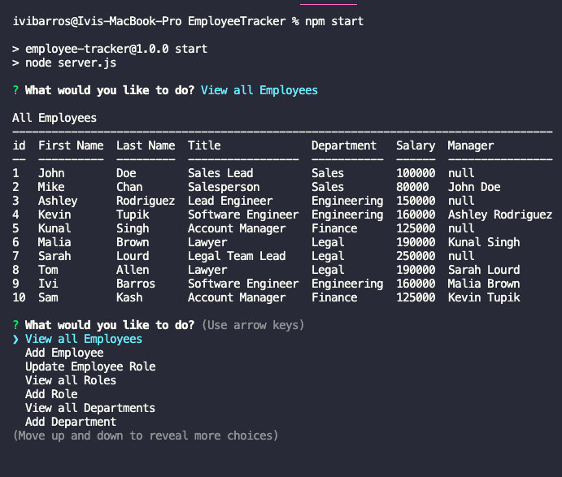
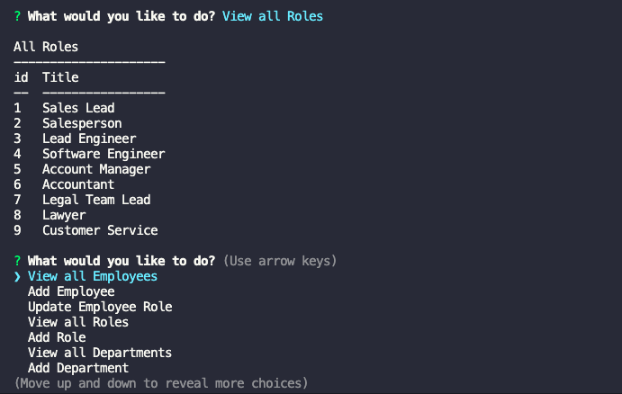
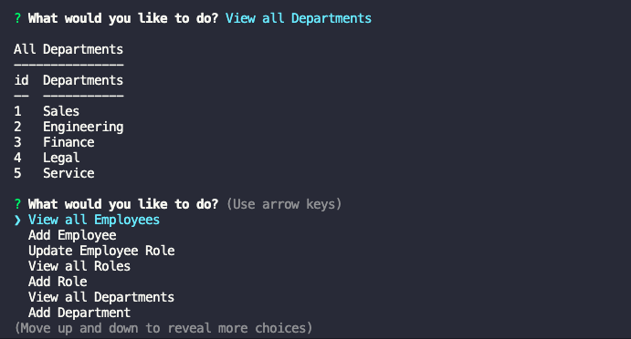

# Employee Tracker

## License

  
   
  
  
## Technologies
     
   
  
  
  <h2>Table of Contents</h2>
  
  * [Technologies](#tech)
  * [Description](#description)
  * [Usage](#usage)
  * [Screenshots](#scrs)
  * [Link to the live view](#live)
  * [Questions](#questions)

## Description
[Main Menu](#home)

Developers frequently have to create interfaces that allow non-developers to easily view and interact with information stored in databases. These interfaces are called **content management systems (CMS)**. 

My challenge for this project was to build a command-line application from scratch to manage a company's employee database, using Node.js, Inquirer, and MySQL. With that said, the user is able to view and manage the departments, roles, and employees in their database to better organize and plan their business or projects.

## Usage

[Main Menu](#home)
  
To run the application, please run the command line: "npm install" or "npm i" followed by the command "npm start"

 

## Screenshots 
<table>
<tr>
<td></td>
<tr>
<td></td>
<tr>
<td></td>
</tr>
</tr>
</table>
 

## Live view
[Main Menu](#home)

GitHub Repository-> <a href="https://github.com/ibarros19/EmplTr" target="_blank">LINK</a> 
 
Video Demo-> <a href="https://youtu.be/ILOAL9LC7tQ" target="_blank">LINK</a> 

## Questions
[Main Menu](#home)

If you have any further questions, please feel free to contact me on GitHub at [ivibarros19](https://github.com/ivibarros19) or by email at [ivibarros19@gmail.com](ivibarros19@gmail.com).
